# Door lock with a four-digit PIN, twelve button keypad, a relay and the ability to change the PIN

### Team members

Sedláček David   
Sedláček Marek   
Sedláček Matyáš    
Sladkowski David     

[Github project folder]( http://github.com/xxx)

### Project objectives

Create a door lock system with a PIN (4-digit) terminal, 12 push buttons, 4-digit 7-segment display and a relay for door lock control, with the ability to change the PIN after inputting the correct value. After not getting an input for a time, the device will reset itself.

Therefore we need to be able to: 
1. assign values to button presses, keep track of the position of the currently pressed digit
2. keep time for the autoreset after an idle period and for how long should the relay stay opened
3. store the value of the correct password in a way that enables changing it
4. compare the current value with the correct value for the current digit and eventually determine if the PIN is correct or not
5. drive a common anode 4-digit 7-segment display to show what has been pressed
6. make an external circuit for the buttons, relay, LEDs and display
7. make it work on Arty A7-35T/100T


## Hardware description
### ARTY A7-100

This project is based around the FPGA board ARTY A7-100T (has better capabilites when it comes to processing compared the ARTY A7-35T, therefore being better for potential future expansions, although if budget is a concern, the current version should run on the 35T as well with no problems). It is powered by 5V, the clock frequency is 100 MHz and has 256MB of RAM (DDR3L). Out of the available pins we have used the PMOD ones, which are grouped in four connectors of twelve pins (8 signal pins, 2 VCC, and 2 ground pins). Two of these connectors are high-speed, the other two are categorized as standard. The high-speed ones were used for the displays and the standard ones for buttons and such.

### External circuit

#### Schematic

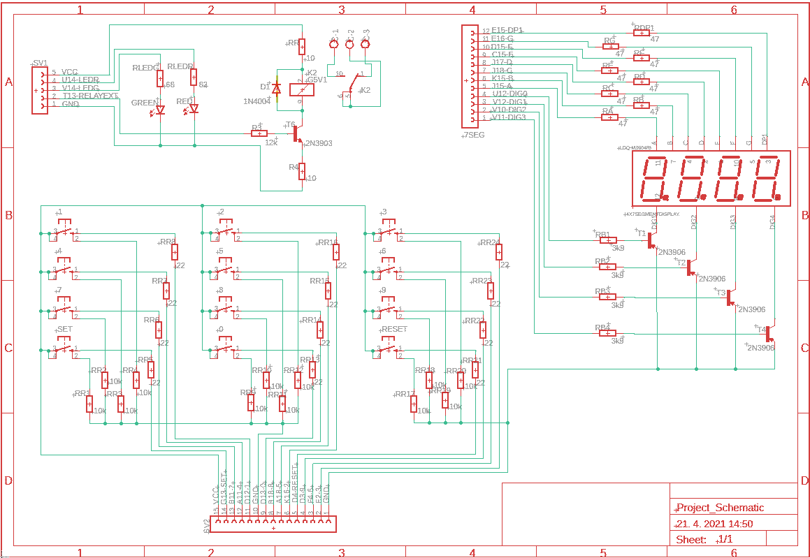

#### Used parts

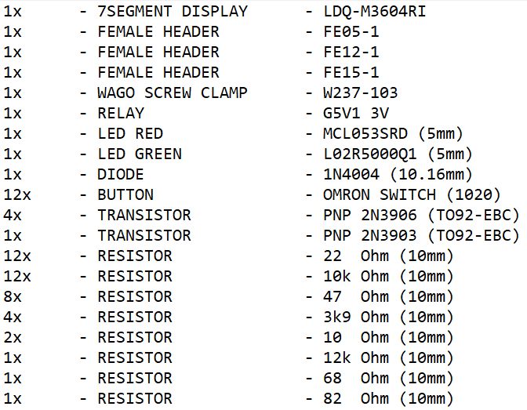

#### Description

The external circuitry can be separated into three parts - the buttons, the display and the relay grouped with LEDs. 

The buttons have 3.3 V on their input, when a button is pressed, the voltage is transfered to the FPGA board input. They're connected to the supply voltage through 10k ohm resistors, this ensures that at the input of ARTY A7-100T, we can only get either a logical 1 or a logical 0, preventing undeterminable states. The 22 ohm resistors serve as protection. Each button has its own pin connection, due to the number of pins on the board being high enough for the projects needs. Potential improvement to save more pins (if the project were to be expanded input/output-wise) would be to connect them in a matrix.

For the display, the signals come in through 47 ohm resistors connected to the cathodes of the individual segments. The display used is the common anode type. The four PNP transistors are there to ensure only one display can be lit up at the same time. The anodes will be switching at periodic intervals, too fast for human vision, thus appearing as if all the diplays are lit at the same time.

As for the LEDs and the relay, the current through the red LED is limited by an 82 ohm resistor, 68 ohm for the green one. These prevent them from burning. The red LED will light up, if the PIN is incorrect, the green one in the opposite case. The relay is controlled by an NPN transistor, which, after it's base goes high, will open the relay. Connected parallel to the relay is a diode, through which the relay coil can discharge, after the relay is turned off.

Below are images of the PCB design

### PCB design

#### PCB top

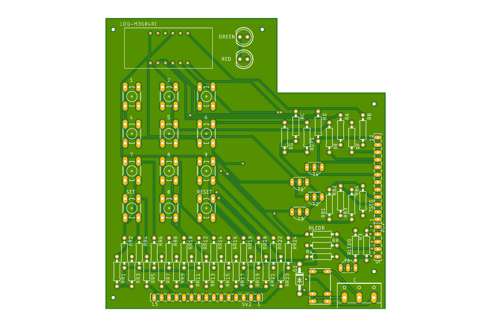

#### PCB bottom

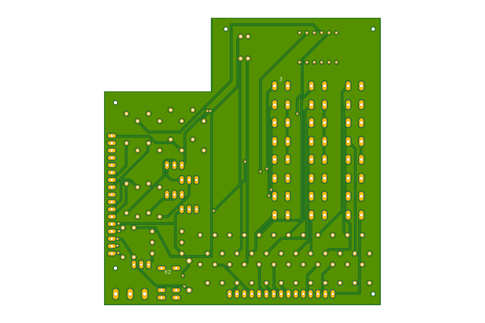

#### PCB 3D model

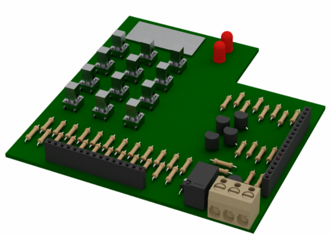

## VHDL modules description and simulations

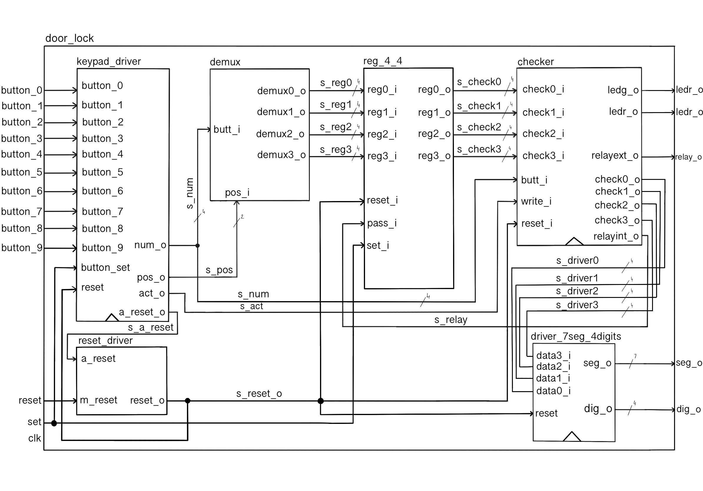

### keypad_driver

#### Visual representation:

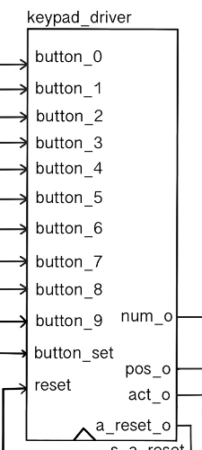

#### State diagram:

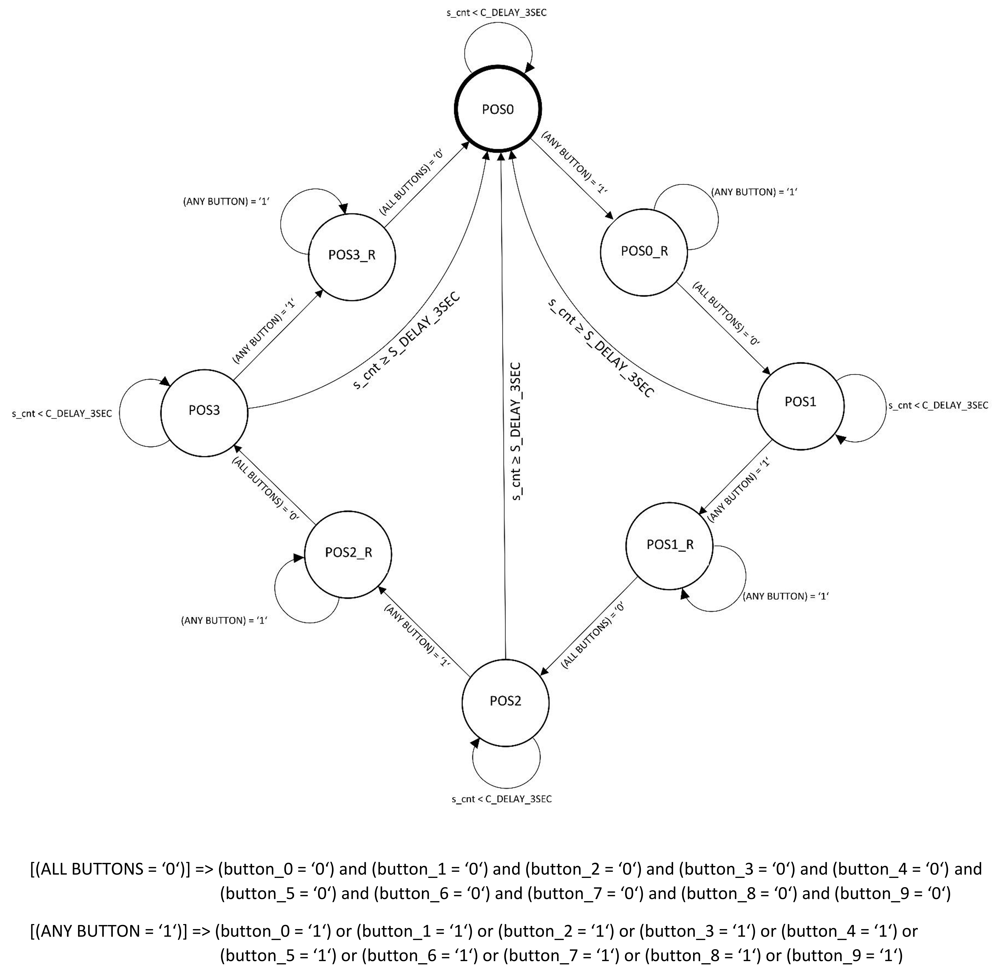

#### Description:

The keypad_driver block functions as a middleman, first translating information from the input buttons and then transferring it to the checker block. A decision was made early in the project development to discard the idea of a button matrix input in favor of working with individual buttons, seeing as the FPGA board used has enough input/output pins to do so. This also determined parts of the design of the external board, which was shown and discussed above.

The keypad_driver provides the rest of the blocks with information about keypresses, assigns 4-bit values to buttons and keeps track of the position at which the value should appear. It uses a finite state machine to cycle through 4 positions using 8 states. The reason it uses 2 states (wait for press and wait for release) for each position, is to precisely determine whether the pressed button has been released, so it can without any doubt jump to the next position. While no button is pressed, the keypad-driver sends out a 4-bit signal of “1111”, indicating to the other blocks that there is no input.

Keypad_driver also handles the automatic reset function which activates after an idle period with no input. This function has been implemented so that the lock wipes itself in the case that someone inputs, for example, two values and walks off.

From the simulation waveforms, we see that the outputted position starts correctly indexing from 0, and (although we can't see here if they are actually correct, will be seen in the other simulations) button presses change the button value output's value. We can see that two buttons at the same time are sent out as only a single number out of the two (we can count button presses by s_act, only when it's '1' is the button press legitimate), which is important for the correct function of the rest of the blocks. We also see the autoreset turning on after an idle period with no button presses, here it's arbitrary, for the simulation to be fast, the time can be changed by changing the c_DELAY_1SEC to a more realistic value.

#### Simulation waveforms:

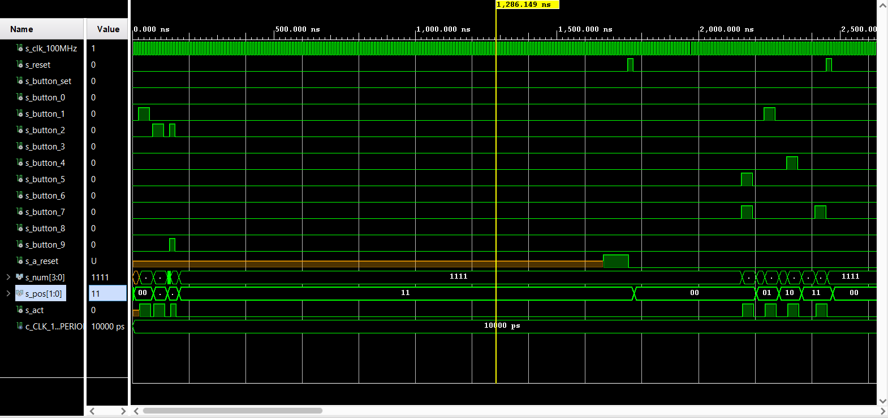

#### testbench: [tb_keypad_driver.vhd](Individual_Modules/Testbenches/tb_keypad_driver.vhd)

#### VHDL architecture:
```vhdl
architecture Behavioral of keypad_driver is

    type decoder_state is (POS0, POS0_R, POS1, POS1_R, POS2, POS2_R, POS3, POS3_R);
    signal s_state  : decoder_state;

    signal s_cnt    : unsigned(8 - 1 downto 0);

    constant c_DELAY_1SEC : unsigned(8 - 1 downto 0) := b"1001_0110";
    constant c_ZERO       : unsigned(8 - 1 downto 0) := b"0000_0000";
    
begin
    p_decoder_fsm : process(clk)
    begin
        if rising_edge(clk) then
            if (reset = '1') then
                s_state <= POS0;
                
                num_o   <= "1111";
                act_o   <= '0';
                -- Reset counter
                s_cnt   <= c_ZERO;
                
                a_reset_o <= '0';
           
            else
                case s_state is
                
                    when POS0 =>
                        
                        pos_o <= "00";
                        
                        if (button_0 = '1') then                          
                            num_o   <= "0000";
                            s_state <= POS0_R;
                            act_o <= '1';
                            s_cnt <= c_ZERO;
                        elsif (button_1 = '1') then   
                            num_o <= "0001";
                            s_state <= POS0_R;
                            act_o <= '1';
                            s_cnt <= c_ZERO;
                        elsif (button_2 = '1') then   
                            num_o <= "0010";
                            s_state <= POS0_R;
                            act_o <= '1';
                            s_cnt <= c_ZERO;
                        elsif (button_3 = '1') then   
                            num_o <= "0011";
                            s_state <= POS0_R;
                            act_o <= '1';
                            s_cnt <= c_ZERO;    
                        elsif (button_4 = '1') then   
                            num_o <= "0100";
                            s_state <= POS0_R;
                            act_o <= '1';
                            s_cnt <= c_ZERO;        
                        elsif (button_5 = '1') then   
                            num_o <= "0101";
                            s_state <= POS0_R;
                            act_o <= '1';
                            s_cnt <= c_ZERO;       
                        elsif (button_6 = '1') then   
                            num_o <= "0110";
                            s_state <= POS0_R;
                            act_o <= '1';
                            s_cnt <= c_ZERO;         
                        elsif (button_7 = '1') then   
                            num_o <= "0111";
                            s_state <= POS0_R;
                            act_o <= '1';
                            s_cnt <= c_ZERO;         
                        elsif (button_8 = '1') then   
                            num_o <= "1000";
                            s_state <= POS0_R;
                            act_o <= '1';
                            s_cnt <= c_ZERO;         
                        elsif (button_9 = '1') then   
                            num_o <= "1001";
                            s_state <= POS0_R;
                            act_o <= '1';
                            s_cnt <= c_ZERO;         
                        --else
                 
                        end if;
                        
                    when POS0_R =>
                        
                        pos_o <= "00";
                        
                        if (button_0 = '0' and button_1 = '0' and
                            button_2 = '0' and button_3 = '0' and
                            button_4 = '0' and button_5 = '0' and
                            button_6 = '0' and button_7 = '0' and
                            button_8 = '0' and button_9 = '0') then
                            s_state <= POS1;
                            act_o <= '0';     
                        end if;
                        
                    when POS1 =>
                        
                        pos_o <= "01";
                        
                        if (button_0 = '1') then                          
                            num_o   <= "0000";
                            s_state <= POS1_R;
                            act_o <= '1';
                            s_cnt <= c_ZERO;
                        elsif (button_1 = '1') then   
                            num_o <= "0001";
                            s_state <= POS1_R;
                            act_o <= '1';
                            s_cnt <= c_ZERO;   
                        elsif (button_2 = '1') then   
                            num_o <= "0010";
                            s_state <= POS1_R;
                            act_o <= '1';
                            s_cnt <= c_ZERO;        
                        elsif (button_3 = '1') then   
                            num_o <= "0011";
                            s_state <= POS1_R;
                            act_o <= '1';
                            s_cnt <= c_ZERO;
                        elsif (button_4 = '1') then   
                            num_o <= "0100";
                            s_state <= POS1_R;
                            act_o <= '1';
                            s_cnt <= c_ZERO;       
                        elsif (button_5 = '1') then   
                            num_o <= "0101";
                            s_state <= POS1_R;
                            act_o <= '1';
                            s_cnt <= c_ZERO;          
                        elsif (button_6 = '1') then   
                            num_o <= "0110";
                            s_state <= POS1_R;
                            act_o <= '1';
                            s_cnt <= c_ZERO;          
                        elsif (button_7 = '1') then   
                            num_o <= "0111";
                            s_state <= POS1_R;
                            act_o <= '1';
                            s_cnt <= c_ZERO;  
                        elsif (button_8 = '1') then   
                            num_o <= "1000";
                            s_state <= POS1_R;
                            act_o <= '1';
                            s_cnt <= c_ZERO;       
                        elsif (button_9 = '1') then   
                            num_o <= "1001";
                            s_state <= POS1_R;
                            act_o <= '1';
                            s_cnt <= c_ZERO;        
                        else
                            if (s_cnt < c_DELAY_1SEC) then
                                s_cnt <= s_cnt + 1;
                                num_o <= "1111";
                            else
                                -- s_state <= POS0;
                                -- s_cnt <= c_ZERO;
                                a_reset_o <= '1';
                            end if;  
                        end if;
                        
                    when POS1_R =>
                        
                        pos_o <= "01";
                        
                        if (button_0 = '0' and button_1 = '0' and
                            button_2 = '0' and button_3 = '0' and
                            button_4 = '0' and button_5 = '0' and
                            button_6 = '0' and button_7 = '0' and
                            button_8 = '0' and button_9 = '0') then
                            s_state <= POS2;
                            act_o <= '0';                        
                        end if; 
                       
                    when POS2 =>
                        
                        pos_o <= "10";
                        
                        if (button_0 = '1') then                          
                            num_o   <= "0000";
                            s_state <= POS2_R;
                            act_o <= '1';
                            s_cnt <= c_ZERO;
                        elsif (button_1 = '1') then   
                            num_o <= "0001";
                            s_state <= POS2_R;
                            act_o <= '1';
                            s_cnt <= c_ZERO; 
                        elsif (button_2 = '1') then   
                            num_o <= "0010";
                            s_state <= POS2_R;
                            act_o <= '1';
                            s_cnt <= c_ZERO;      
                        elsif (button_3 = '1') then   
                            num_o <= "0011";
                            s_state <= POS2_R;
                            act_o <= '1';
                            s_cnt <= c_ZERO;         
                        elsif (button_4 = '1') then   
                            num_o <= "0100";
                            s_state <= POS2_R;
                            act_o <= '1';
                            s_cnt <= c_ZERO;        
                        elsif (button_5 = '1') then   
                            num_o <= "0101";
                            s_state <= POS2_R;
                            act_o <= '1';
                            s_cnt <= c_ZERO;         
                        elsif (button_6 = '1') then   
                            num_o <= "0110";
                            s_state <= POS2_R;
                            act_o <= '1';
                            s_cnt <= c_ZERO;        
                        elsif (button_7 = '1') then   
                            num_o <= "0111";
                            s_state <= POS2_R;
                            act_o <= '1';
                            s_cnt <= c_ZERO;       
                        elsif (button_8 = '1') then   
                            num_o <= "1000";
                            s_state <= POS2_R;
                            act_o <= '1';
                            s_cnt <= c_ZERO;         
                        elsif (button_9 = '1') then   
                            num_o <= "1001";
                            s_state <= POS2_R;
                            act_o <= '1';
                            s_cnt <= c_ZERO;         
                        else
                            if (s_cnt < c_DELAY_1SEC) then
                                s_cnt <= s_cnt + 1;
                                num_o <= "1111";
                            else
                                -- s_state <= POS0;
                                -- s_cnt <= c_ZERO;
                                a_reset_o <= '1';
                            end if;                            
                        end if;
                        
                    when POS2_R =>
                        
                        pos_o <= "10";
                        
                        if (button_0 = '0' and button_1 = '0' and
                            button_2 = '0' and button_3 = '0' and
                            button_4 = '0' and button_5 = '0' and
                            button_6 = '0' and button_7 = '0' and
                            button_8 = '0' and button_9 = '0') then
                            s_state <= POS3;
                            act_o <= '0';                      
                        end if; 
                        
                    when POS3 =>
                        
                        pos_o <= "11";
                        
                        if (button_0 = '1') then                          
                            num_o   <= "0000";
                            s_state <= POS3_R;
                            act_o <= '1';
                            s_cnt <= c_ZERO;
                        elsif (button_1 = '1') then   
                            num_o <= "0001";
                            s_state <= POS3_R;
                            act_o <= '1';
                            s_cnt <= c_ZERO;    
                        elsif (button_2 = '1') then   
                            num_o <= "0010";
                            s_state <= POS3_R;
                            act_o <= '1';
                            s_cnt <= c_ZERO;         
                        elsif (button_3 = '1') then   
                            num_o <= "0011";
                            s_state <= POS3_R;
                            act_o <= '1';
                            s_cnt <= c_ZERO;         
                        elsif (button_4 = '1') then   
                            num_o <= "0100";
                            s_state <= POS3_R;
                            act_o <= '1';
                            s_cnt <= c_ZERO;        
                        elsif (button_5 = '1') then   
                            num_o <= "0101";
                            s_state <= POS3_R;
                            act_o <= '1';
                            s_cnt <= c_ZERO;        
                        elsif (button_6 = '1') then   
                            num_o <= "0110";
                            s_state <= POS3_R;
                            act_o <= '1';
                            s_cnt <= c_ZERO;        
                        elsif (button_7 = '1') then   
                            num_o <= "0111";
                            s_state <= POS3_R;
                            act_o <= '1';
                            s_cnt <= c_ZERO;       
                        elsif (button_8 = '1') then   
                            num_o <= "1000";
                            s_state <= POS3_R;
                            act_o <= '1';
                            s_cnt <= c_ZERO;         
                        elsif (button_9 = '1') then   
                            num_o <= "1001";
                            s_state <= POS3_R;
                            act_o <= '1';
                            s_cnt <= c_ZERO;
                        else
                            if (s_cnt < c_DELAY_1SEC) then
                                s_cnt <= s_cnt + 1;
                                num_o <= "1111";
                            else
                                -- s_state <= POS0;
                                -- s_cnt <= c_ZERO;
                                a_reset_o <= '1';
                            end if;
                        end if;
                        
                    when POS3_R =>
                        
                        pos_o <= "11";
                        
                        if (button_0 = '0' and button_1 = '0' and
                            button_2 = '0' and button_3 = '0' and
                            button_4 = '0' and button_5 = '0' and
                            button_6 = '0' and button_7 = '0' and
                            button_8 = '0' and button_9 = '0' and
                            button_set = '0') then
                            s_state <= POS0;
                            act_o <= '0';          
                        end if; 
                                   
                end case;
            end if; 
        end if;
    end process p_decoder_fsm; 


end Behavioral;
``` 

### reset_driver

#### Visual representation:

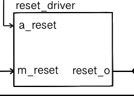

#### Description:

Reset driver is a simple block, working as an OR gate for 2 input signals. Both are one-bit signals, one sent form keypad_driver as an auto-reset, the other is connected to the reset button on the external board. After any of reset_driver’s inputs is set HIGH (equal to ‘1’) it drives the output signal HIGH as well, which in this case resets all the modules connected to the output. It has been created to enable the keypad_driver to reset the whole project.

#### Simulation waveforms:

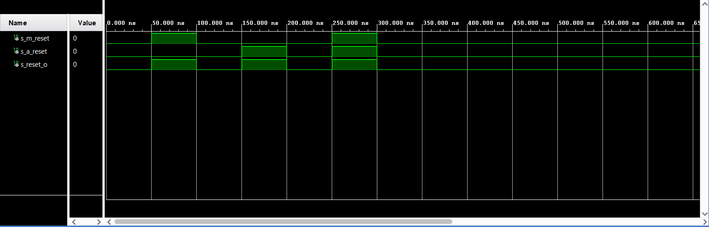

#### testbench: [tb_reset_driver.vhd](Individual_Modules/Testbenches/tb_reset_driver.vhd)

#### VHDL architecture:
```vhdl
architecture Behavioral of reset_driver is

begin
    p_reset_driver : process(m_reset, a_reset)
    begin
        
        if (a_reset = '1' or m_reset = '1') then
            reset_o <= '1';
        else
            reset_o <= '0';
        end if;
        
    end process p_reset_driver;

end Behavioral;
``` 

### demux

#### Visual representation:

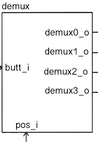

#### Description:

This block is, as the name suggests, a demultiplexer. It's job is to assign the 4-bit button value input (butt_i) to one of the outputs based on the value of the 2-bit position input (pos_i). It's the first block of the two block system for the storage of the correct combination. It is always active, even when the PIN is not being changed, since there is no need to turn it off, that becomes important only on the second block of the password storage system, the 4 times 4-bit register.

In the simulation we see the behaviour exactly as described above, the input being assigned to an output based on the value of the position coming in from keypad_driver.

#### Simulation waveforms:

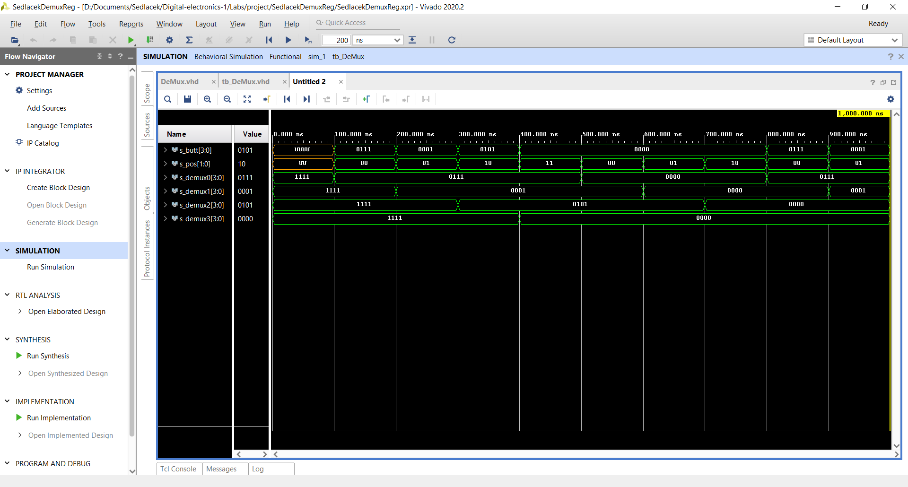

#### testbench: [tb_DeMux.vhd](Individual_Modules/Testbenches/tb_DeMux.vhd)

#### VHDL architecture:
```vhdl
architecture Behavioral of demux is
        begin
        
        p_demux : process(pos_i, butt_i)
        begin

            case pos_i is
                when "00" => 
                    demux0_o <= butt_i;
                when "01" => 
                    demux1_o <= butt_i;
                when "10" => 
                    demux2_o <= butt_i;
                when "11" => 
                    demux3_o <= butt_i;
                when others =>
                    demux0_o <= "1111";
                    demux1_o <= "1111";
                    demux2_o <= "1111";
                    demux3_o <= "1111";
             end case;      
        
        end process p_demux;
    end Behavioral;
``` 

### reg_4_4

#### Visual representation:

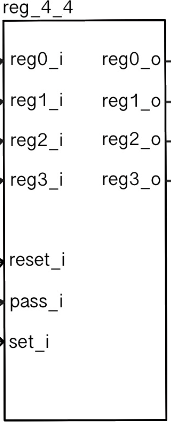

#### Description:

This block is a 16-bit register, split into four 4-bit registers. In principle, it's basically a group of D latches with a condition on the enable input. It's job is to, if the set_i (activated by a button which must be held) and pass_i (which is active ONLY when the door is unlocked by entering the correct password, for a predetermined amount of time) inputs are set high, record and store the inputs coming from the demultiplexer into the correct outputs, thus changing the combination of values that the checker block (where the comparation of the current and correct values takes place) will read. In the situation that the set_i, pass_i and reset_i inputs are all activated, the correct PIN (register output) will change to the combination "3142". The local check signal is present so that the register isn't permanently stuck in the default password branch.

In the simulation waves, we see that just the pass_i has no effect. When combined with set_i, input values start getting assigned to their corresponding output. If only set is on, nothing changes, (same for reset, not shown here, but obvious from the final project waveforms). If pass,set and reset are on, we change to the default combination.

#### Simulation waveforms:

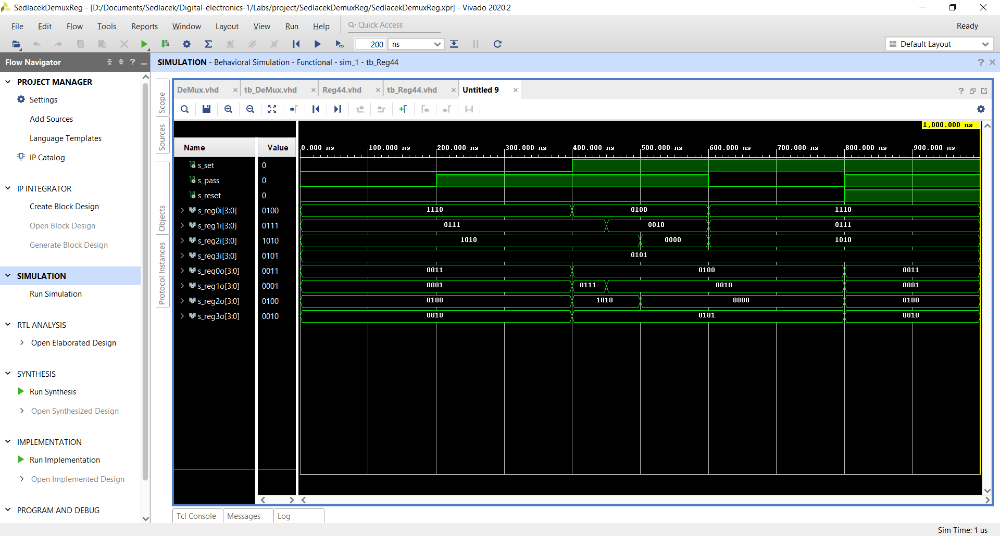

#### testbench: [tb_Reg44.vhd](Individual_Modules/Testbenches/tb_Reg44.vhd)

#### VHDL architecture:
```vhdl

architecture Behavioral of reg_4_4 is

    signal s_local_check : std_logic;

begin

    p_register : process(pass_i, set_i, reset_i, reg0_i, reg1_i, reg2_i, reg3_i)
    begin
    
    if (pass_i='1' and set_i='1' and reset_i='1') then
            reg0_o <= "0011";
            reg1_o <= "0001";
            reg2_o <= "0100";
            reg3_o <= "0010";
            s_local_check <= '1';
    elsif (pass_i='1' and set_i='1' and reset_i='0' and s_local_check <= '0') then
            reg0_o <= reg0_i;
            reg1_o <= reg1_i;
            reg2_o <= reg2_i;
            reg3_o <= reg3_i;
    elsif (set_i = '0') then -- pass_i='1' and
        s_local_check <= '0';
    end if;
    
    end process p_register;
end Behavioral;
``` 

### checker

#### Visual representation:

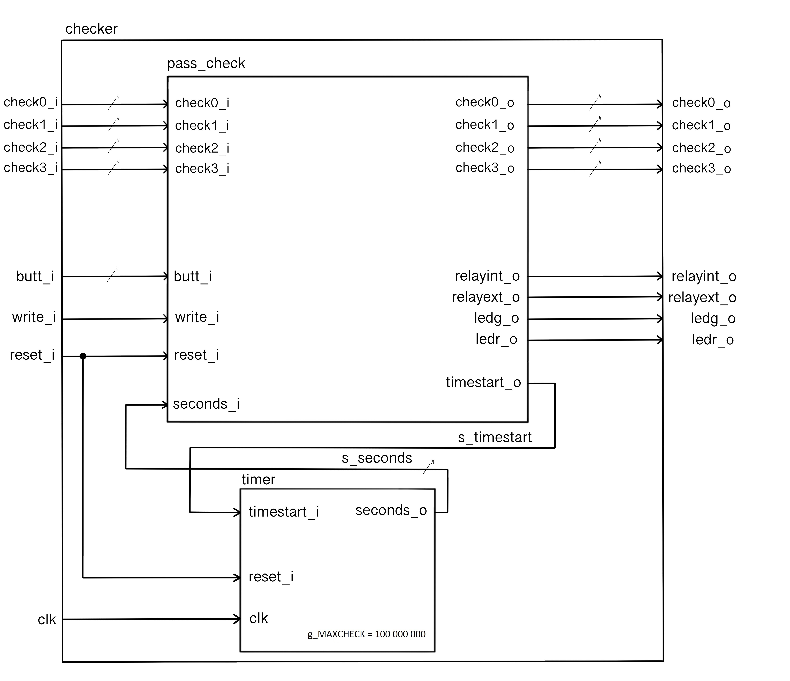

#### Description:

The checker block is an amalgamation of two separate blocks, pass_check (the Moore FSM for judging the entered combination) and the timer block.

The simulation waveform will be described for each block separately, the screenshot below can be referred to later for verification.

#### Simulation waveforms:

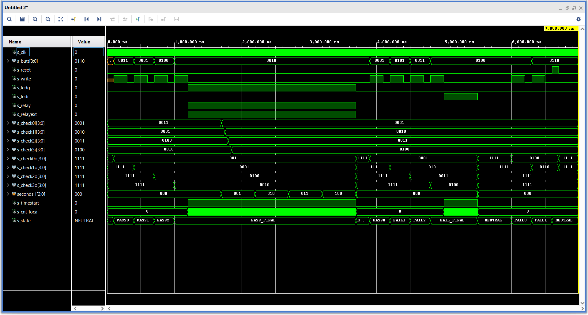

#### testbench: [tb_checker.vhd](Individual_Modules/Testbenches/tb_checker.vhd)

#### VHDL architecture:
```vhdl
architecture Behavioral of checker is

    signal s_timestart  : std_logic;
    signal s_seconds    : std_logic_vector(2 downto 0);

begin

    timer0 : entity work.timer
    
        generic map(
            g_MAXCHECK => 50 -- realistically 100 000 000
        )
        port map(
            clk => clk,
            reset_i => reset_i,
            timestart_i => s_timestart,
            seconds_o => s_seconds 
        );
        
    pass_check0 :  entity work.pass_check
          port map(
                butt_i       =>  butt_i,
                reset_i      =>  reset_i,
                write_i      =>  write_i,
                seconds_i    =>  s_seconds,
                ledg_o       =>  ledg_o,
                ledr_o       =>  ledr_o,
                relayint_o   =>  relayint_o,
                relayext_o   =>  relayext_o,
                timestart_o  =>  s_timestart,
                check0_i     =>  check0_i,
                check1_i     =>  check1_i,
                check2_i     =>  check2_i,
                check3_i     =>  check3_i,
                check0_o     =>  check0_o,
                check1_o     =>  check1_o,
                check2_o     =>  check2_o,
                check3_o     =>  check3_o
                                
                );  

end Behavioral;
``` 

### pass_check

#### State diagram:

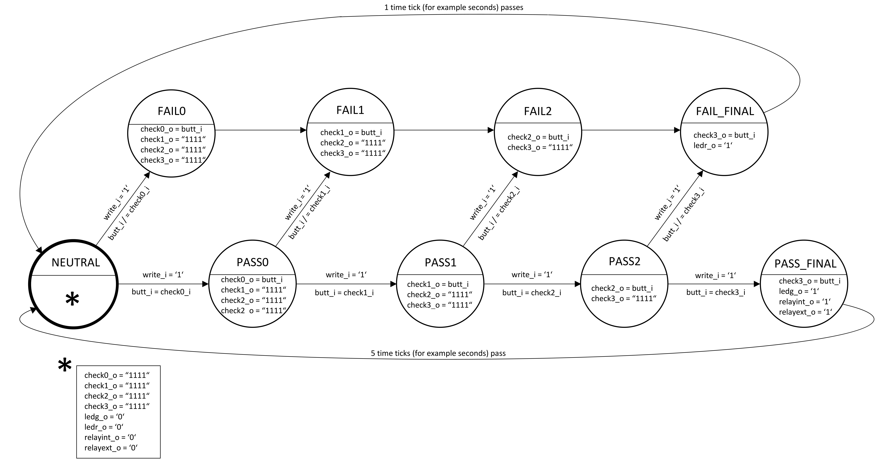

#### Description:

As stated, this is a Moore type finite state machine, meaning that the outputs are determined by the current state. As we can see from the diagram, we have an initial NEUTRAL state, where all the outputs are off and the combination being sent to the displays is "1111", which the diplay driver interprets as "nothing lights up". When a button is pressed, it's value comes through the butt_i input and the write_i input activates, that way, we ensure we process only legitimate button presses and enables us to read the same value pressed twice as two separate inputs.

When we detect a legitimate button press, we compare the value at butt_i to the value of the passwords first number (check0_i), if they match, the state changes to PASS0, if they don't, we go to FAIL0 and so on. This means, each button press is compared separately. Two things to note are: Firstly, that we can slip into a fail state at each separate button press and not know about it until we enter the whole combination. All inputs are outputted to the display no matter if they are correct or not. Secondly, if the reset_i is activated at any time (either manually or automatically by keypad_driver), we are returned back to the NEUTRAL state. This is NOT incorporated into the state diagram, since it quickly becomes overcrowded by lines and conditions and results mostly in confusion, which defeats the purpose of making a state diagram in the first place.

We see the diagram has two branches, at the end of each there is a final state, either FAIL_FINAL or PASS_FINAL. FAIL_FINAL results in the red LED turning on and it sends a signal through the timestart_o output to the timer, which starts counting one "tick" of time (in the real implementation seconds, had to be shortened in the simulation). When the correct number of ticks is read on the seconds_i input, the state shifts to the NEUTRAL state. Similarly to this the PASS_FINAL state activates the green LED and opens the relay for five time "ticks" (time is kept by the same mechanism as above). During this, it also send an internal signal through the relayint_o output to the reg_4_4 register, which allows the user to change the correct combination for the duration of these five "ticks". After those pass, pass_check shifts to the NEUTRAL state. If we change the combination to the default one by pressing set and reset, it shifts to NEUTRAL immediately.

There is potential for future improvement here, namely that the relayint_o could stay on indefinetly, as long as set is pressed during the time that relayint_o was 
already turned on by the door opening.

From the simulation waveforms we see that the finite state machine is working as intended (described above), outputted values for the display are in the correct position, LEDs, relay and timestart turn on appropriately, and in NEUTRAL all outputs go to "1111". Note that the FINAL states are not timed since this is only the pass_check block.

#### Simulation waveforms:

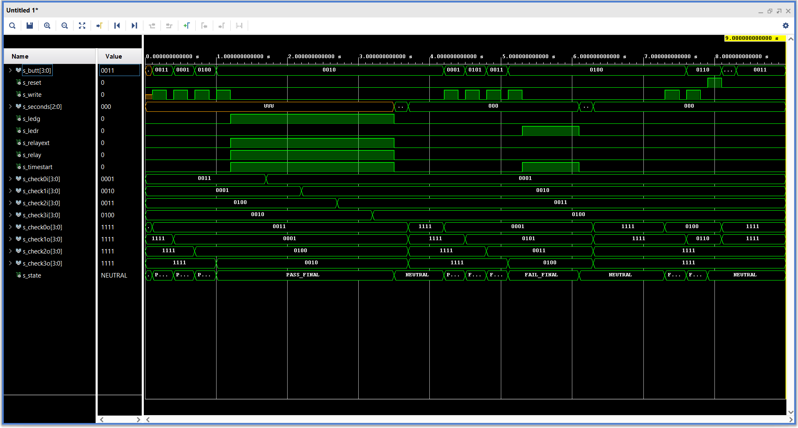

#### testbench: [tb_passCheck.vhd](Individual_Modules/Testbenches/tb_passCheck.vhd)

#### VHDL architecture:
```vhdl
architecture Behavioral of pass_check is
    type t_state is (NEUTRAL,
                     PASS0,
                     PASS1,
                     PASS2,
                     PASS_FINAL,
                     FAIL0,
                     FAIL1,
                     FAIL2,
                     FAIL_FINAL);
    
    signal s_state  : t_state;


begin
    
    p_passcheck: process(reset_i, write_i, butt_i,seconds_i, check0_i, check1_i, check2_i, check3_i)
    begin
        if (reset_i ='1') then
            s_state <= NEUTRAL;
        elsif (reset_i ='0') then
            case s_state is 
                
                when NEUTRAL =>
                
                    timestart_o <= '0';
                    ledg_o <= '0';
                    ledr_o <= '0';
                    relayint_o <= '0';
                    relayext_o <= '0';
                
                    check0_o <= "1111";
                    check1_o <= "1111";
                    check2_o <= "1111";
                    check3_o <= "1111";
                    if ((check0_i = butt_i) and write_i = '1') then
                        check0_o <= butt_i;
                        s_state <= PASS0;
                    elsif ((check0_i /= butt_i) and write_i = '1') then
                        check0_o <= butt_i;
                        s_state <= FAIL0;
                    else
                        null;
                    end if;
                    
                when PASS0 =>
                    if ((check1_i = butt_i) and write_i = '1') then
                        check1_o <= butt_i;
                        s_state <= PASS1;
                    elsif ((check1_i /= butt_i) and write_i = '1') then
                        check1_o <= butt_i;
                        s_state <= FAIL1;
                    else
                        null;
                    end if;
                
                when PASS1 =>
                    if ((check2_i = butt_i) and write_i = '1') then
                        check2_o <= butt_i;
                        s_state <= PASS2;
                    elsif ((check2_i /= butt_i) and write_i = '1') then
                        check2_o <= butt_i;
                        s_state <= FAIL2;
                    else
                        null;
                    end if;
                
                when PASS2 =>
                    if ((check3_i = butt_i) and write_i = '1') then
                        check3_o <= butt_i;
                        s_state <= PASS_FINAL;
                    elsif ((check3_i /= butt_i) and write_i = '1') then
                        check3_o <= butt_i;
                        s_state <= FAIL_FINAL;
                    else
                        null;
                    end if;
                    
                when PASS_FINAL =>
                    timestart_o <= '1';
                    if (seconds_i < "101") then
                        ledg_o <= '1';
                        relayint_o <= '1';
                        relayext_o <= '1';
                    elsif (seconds_i = "101") then
                        ledg_o <= '0';
                        relayint_o <= '0';    
                        relayext_o <= '0';                       
                        timestart_o <= '0';
                        s_state <= NEUTRAL;
                    end if;
                
                when FAIL0 =>
                    if (write_i = '1') then
                        check1_o <= butt_i;
                        s_state <= FAIL1;
                    end if;    
                
                when FAIL1 =>
                    if (write_i = '1') then
                        check2_o <= butt_i;
                        s_state <= FAIL2;
                    end if;
                    
                when FAIL2 =>
                    if (write_i = '1') then
                        check3_o <= butt_i;
                        s_state <= FAIL_FINAL;
                    end if;
                
                when FAIL_FINAL =>
                    timestart_o <= '1';
                    if (seconds_i < "001") then
                        ledr_o <= '1';
                        relayint_o <= '0'; 
                        relayext_o <= '0'; 
                    elsif (seconds_i = "001") then
                        ledr_o <= '0';                        
                        timestart_o <= '0';
                        s_state <= NEUTRAL;
                    end if;
                    
                when others =>
                    s_state <= NEUTRAL;
                    
              end case;
             end if;
           end process p_passcheck;     
                  
end Behavioral;
``` 

### timer

#### Description:

As soon as timestart_i activates, this block starts counting clock pulses. There are two counters, one is, as mentioned, for individual clock pulses, the other is for counting how many times has the previous counter filled (determined by a constant), thus counting the time "ticks" that have passed. The second counter is outputted to seconds_o, which is read by pass_check, once it reads the correct number from its seconds_i, it shifts to NEUTRAL, in which, timestart_o is deactivated. This effectively resets the timer and it stops counting clock pulses.

In the simulation waveforms, we see that once timestart activates, we start counting clock periods locally, and each set number of periods, the seconds output changes its values up by one until the timestart input goes to zero. Here we count higher than 101 since nothing is stopping the timer, because timestart is controlled by pass_check.

#### Simulation waveforms:

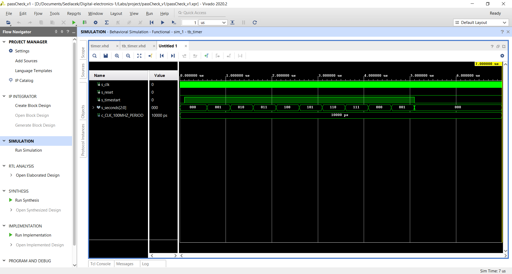

#### testbench: [tb_timer.vhd](Individual_Modules/Testbenches/tb_timer.vhd)

#### VHDL architecture:
```vhdl
architecture Behavioral of timer is
        signal s_cnt_local : natural:= 0;
        signal s_seconds_local : natural:= 1;
begin

p_timer: process(clk)
      begin 
        if timestart_i = '1' then
          if rising_edge(clk) then
              if  (reset_i = '1') then
                    s_cnt_local <= 0;
                    seconds_o <= "000";
              elsif (s_cnt_local >= (g_MAXCHECK - 1)) then
                  s_cnt_local <= 0;                
                  s_seconds_local <= (s_seconds_local + 1);
                  seconds_o <= std_logic_vector(TO_UNSIGNED(s_seconds_local,3)); 
              else
                  s_cnt_local <= (s_cnt_local + 1);
              end if;
          end if;
          elsif timestart_i = '0' then
          seconds_o <= "000"; 
          s_seconds_local <= 1;
          s_cnt_local <= 0;
        end if;
                           
      end process p_timer;  

end Behavioral;
``` 

### driver_7seg_4digits

#### Visual representation:

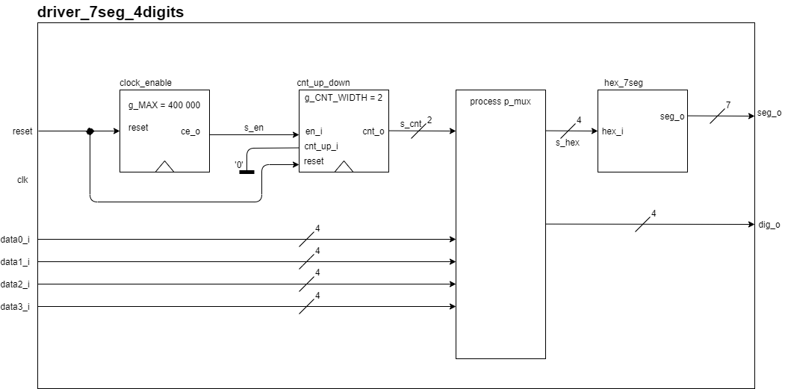

#### Description:


This block and its parts serve, as the name implies, as a driver for the four digit seven segment display used to display the typed in combination, receiving the outputs from the checker block. It was almost entirely pre-made (created during the semester in computer excersises) and only very slightly modified for the specific needs of this project, in the case of hex7seg and the p_mux process. The two main functions of the driver are: one, it connects all the sub-blocks together, two, it hosts the multiplexer process, that is needed to drive multi-digit seven segment displays, switching between the displays at a constant interval, too fast for human perception (here it's 4ms per display, shortened for simulation). The output for the decimal point was removed after some deliberation, originally there was an idea to use the decimal point as an indicator that the wrong combination has been entered, but it was foregone in the favor of having an external LED serve this purpose, driven by the checker block. 

From the simulation waveforms, we can see that the input numbers are being diplayed correctly and the anode is being changed in the desired order, so that the displays show the values from left to right.


#### Simulation waveforms:

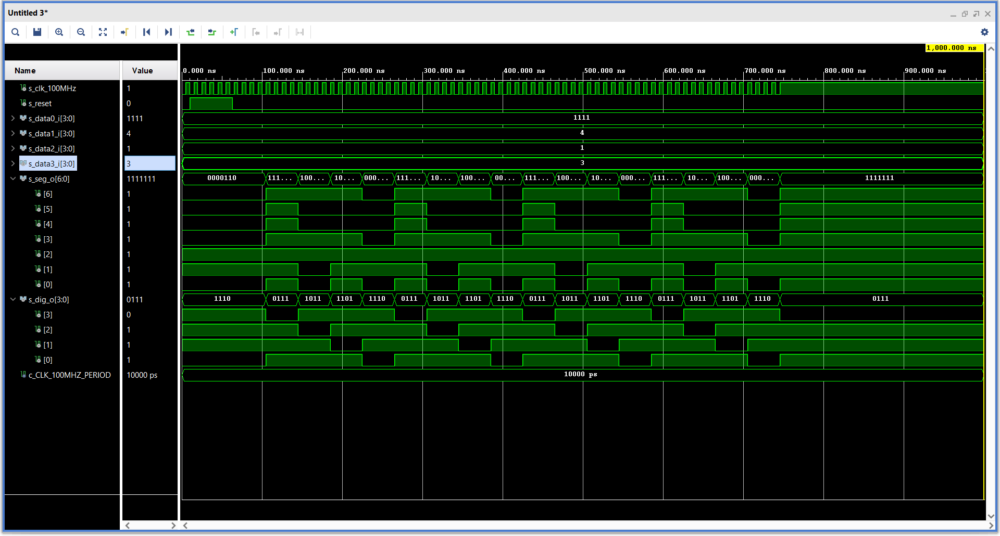

#### testbench: [tb_driver_7seg_4digits.vhd](Individual_Modules/Testbenches/tb_driver_7seg_4digits.vhd)

#### VHDL architecture:
```vhdl
architecture Behavioral of driver_7seg_4digits is

    -- Internal clock enable
    signal s_en  : std_logic;
    -- Internal 2-bit counter for multiplexing 4 digits
    signal s_cnt : std_logic_vector(2 - 1 downto 0);
    -- Internal 4-bit value for 7-segment decoder
    signal s_hex : std_logic_vector(4 - 1 downto 0);

begin
    --------------------------------------------------------------------
    -- Instance (copy) of clock_enable entity generates an enable pulse
    -- every 4 ms
    clk_en0 : entity work.clock_enable
        generic map(
            g_MAX => 4 -- realistically 400 000   
        )
        port map(
            clk   =>  clk,
            reset =>  reset,
            ce_o  =>  s_en
        );

    --------------------------------------------------------------------
    -- Instance (copy) of cnt_up_down entity performs a 2-bit down
    -- counter
    bin_cnt0 : entity work.cnt_up_down
        generic map(
            g_CNT_WIDTH => 2
        )
        port map(
            clk       => clk,
            reset     => reset,
            en_i      => s_en,
            cnt_up_i  => '0',
            cnt_o     => s_cnt
        );

    --------------------------------------------------------------------
    -- Instance (copy) of hex_7seg entity performs a 7-segment display
    -- decoder
    hex2seg : entity work.hex_7seg
        port map(
            hex_i => s_hex,
            seg_o => seg_o
        );

    --------------------------------------------------------------------
    -- p_mux:
    -- A combinational process that implements a multiplexer for
    -- selecting data for a single digit, a decimal point signal, and 
    -- switches the common anodes of each display.
    --------------------------------------------------------------------
    p_mux : process(s_cnt, data0_i, data1_i, data2_i, data3_i)
    begin
        case s_cnt is
            when "11" =>
                s_hex <= data0_i;
                dig_o <= "0111";

            when "10" =>
                s_hex <= data1_i;
                dig_o <= "1011";

            when "01" =>
                s_hex <= data2_i;
                dig_o <= "1101";

            when others =>
                s_hex <= data3_i;
                dig_o <= "1110";

        end case;
    end process p_mux;

end architecture Behavioral;
``` 

### clock_enable (not simulated seperately, was simulated during computer excersises)

#### Description:

This is a clock divider, similar to what is used in the timer block, it counts up to a predefined (g_MAX) number of clock pulses, and toggles it's output accordingly, to create a slower clock, that drives the other blocks in the display driver. It has a synchronous reset, since the condition for it is only checked after determining a rising edge clock event.

### cnt_up_down (not simulated seperately, was simulated during computer excersises)

#### Description:

A counter used by the multiplexer process to determine which input it is supposed to connect to the output. Since this is a four digit number, it counts from 0 to 3, then wraps around. It's also able to change between counting up and down, thus the name, but we do not use this feature in the project.

### hex7seg (not simulated seperately, was simulated during computer excersises)

#### Description:

This block assigns a value to the output of the multiplexer process, assigning seven-bit output values to the four-bit input ones, controlling each segment. It is set up to control a common anode display (lights up on '0'). A small modification was needed here, since "1111" is used as a value to communicate that nothing is lit up on the display, so its assigned output was changed to "1111111" 


## TOP module description and simulations

### door_lock

#### Visual representation:


#### Description:

This is the block that houses all interconnecting internal signals for the entire project. It has been made separate from the top block, so that the project's code isn't entirely dependent on the used Arty A7-100T and a potential change of the FPGA board is easier to implement, e.g. top is effectively seperate from the functional code. In the simulation screenshots below we can see the entire project working (simulations are split for value readability). 

In the first one we can see: First, a situation where two buttons are pressed at the same time. We can see it chooses one of them at random, and proceeds as if only one button was pressed, which is the wanted result, as was already mentioned in the keypad_driver section. Then there is the manual reset being tested, we see the that the display wipes itself and the lock returns to the initial neutral state as wanted. The last thing tested is the autoreset, two buttons (wrong combination, doesn't really matter in this case) have been pressed, then, after an idle period with no input, the autoreset signal (internal, not shown, effects observable) is triggered, wiping the display and sending the lock to NEUTRAL, which is the expected result.

In the second one: First, a correct combination is entered ("3142", the default), which changes the locks state from NEUTRAL to PASS0, PASS1, PASS2 and then PASS_FINAL, which opens the relay, lights up the green LED and sends a signal to the timer which starts counting as we can see. When the door is opened, set is pressed and held and a new password is entered ("1234"), rewriting the values stored in the register block (we can see checker inputs connected to these). When the timer reaches five "ticks" it sends the lock to NEUTRAL, turning off the relay, LED and wiping the display and timer. After a while, "1234" is entered, the lock again step by step enters the PASS_FINAL state. Then, when the door is opened, set is held and reset is pressed, the correct combination changes to the default "3142" and immediately without waiting for the timer to finish sets the state to NEUTRAL, except for the display, relay and LED, which wipes/ turns off when reset is released. This could be problematic, since this way, after entering the correct PIN and holding set and reset while the door is opened, it can be held open indefinetly, as long as reset is being held down. A potential problem to be fixed in a future version, but since it requires the knowledge of the password in the first place, it's not that major of an issue. The last thing checked is the ability to enter the same number twice, which we see works, but since the combination is wrong (even though three out of four values are correct, showing that the order of the entered numbers matters), we go through the FAIL states up to FAIL_FINAL, where we see the red LED light up, timer start up, lasting in this state for one "tick" and then returning to NEUTRAL.

Thus, we see the lock fulfills the project goals set at the start, and as far as we have been able to find, has no major issues, although a small number of minor ones are still present at this time (both with the set password feature), mentioned above, namely that the interval for which the password can be changed is fixed (it is desirable to extend it by holding down the set button) and then the fact that after a set+reset password change, holding reset keeps the door open indefinetly.


#### Simulation waveforms:

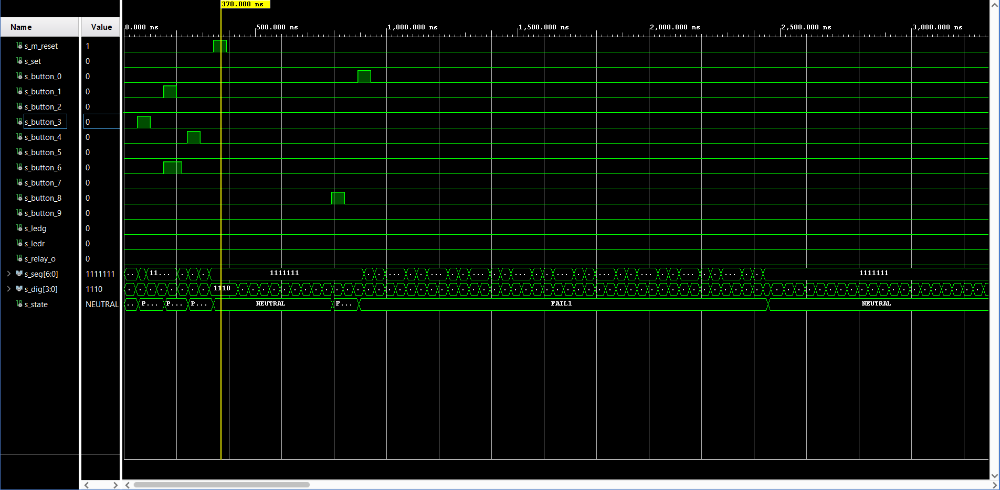

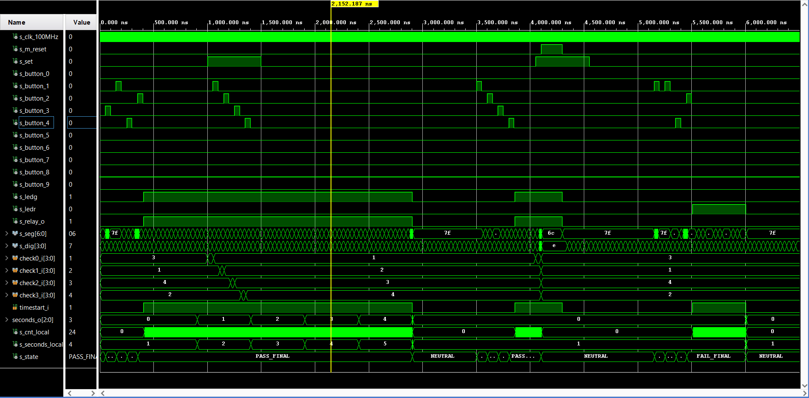

#### testbench (both in one file): [tb_door_lock.vhd](Final_Project/Testbench/tb_door_lock.vhd)

#### VHDL architecture:
```vhdl
architecture Behavioral of door_lock is

    signal s_num  : STD_LOGIC_VECTOR (4 - 1 downto 0);
    signal s_pos  : STD_LOGIC_VECTOR (2 - 1 downto 0);
    signal s_act  : STD_LOGIC;
    
    signal s_reset_o : STD_LOGIC;
    signal s_a_reset : STD_LOGIC;
    
    signal s_reg0  : STD_LOGIC_VECTOR (4 - 1 downto 0);
    signal s_reg1  : STD_LOGIC_VECTOR (4 - 1 downto 0);
    signal s_reg2  : STD_LOGIC_VECTOR (4 - 1 downto 0);
    signal s_reg3  : STD_LOGIC_VECTOR (4 - 1 downto 0);
    
    signal s_check0  : STD_LOGIC_VECTOR (4 - 1 downto 0);
    signal s_check1  : STD_LOGIC_VECTOR (4 - 1 downto 0);
    signal s_check2  : STD_LOGIC_VECTOR (4 - 1 downto 0);
    signal s_check3  : STD_LOGIC_VECTOR (4 - 1 downto 0);
    
    signal s_driver0  : STD_LOGIC_VECTOR (4 - 1 downto 0);
    signal s_driver1  : STD_LOGIC_VECTOR (4 - 1 downto 0);
    signal s_driver2  : STD_LOGIC_VECTOR (4 - 1 downto 0);
    signal s_driver3  : STD_LOGIC_VECTOR (4 - 1 downto 0);
    
    signal s_relay  : STD_LOGIC;

begin

    keypad_driver0  : entity work.keypad_driver
        port map(
            clk         => clk,  
            reset       => s_reset_o,
        
            button_set  => set,
            button_0    => button_0,
            button_1    => button_1,
            button_2    => button_2,
            button_3    => button_3,
            button_4    => button_4,
            button_5    => button_5,
            button_6    => button_6,
            button_7    => button_7,
            button_8    => button_8,
            button_9    => button_9,
                    
            a_reset_o   => s_a_reset,        
            act_o       => s_act,
            pos_o       => s_pos,
            num_o       => s_num
        );
        
    reset_driver0   : entity work.reset_driver
        port map(
            m_reset     => m_reset,
            a_reset     => s_a_reset,
            
            reset_o     => s_reset_o   
        );
        
    demux0  : entity work.demux
        port map(
            butt_i      => s_num,
            pos_i       => s_pos,
            
            demux0_o    => s_reg0,
            demux1_o    => s_reg1,
            demux2_o    => s_reg2,
            demux3_o    => s_reg3
        );
        
    reg_4_40  : entity work.reg_4_4
        port map(
            set_i       => set,
            pass_i      => s_relay,
            reset_i     => s_reset_o,
            reg0_i      => s_reg0,
            reg1_i      => s_reg1,
            reg2_i      => s_reg2,
            reg3_i      => s_reg3,
            
            reg0_o      => s_check0,
            reg1_o      => s_check1,
            reg2_o      => s_check2,
            reg3_o      => s_check3
        );
        
    checker0  : entity work.checker
        port map(
            clk         => clk,
            butt_i      => s_num,
            reset_i     => s_reset_o,
            write_i     => s_act,
            
            ledg_o      => ledg_o,
            ledr_o      => ledr_o,
            
            relayext_o  => relayext_o,
            relayint_o  => s_relay,
            check0_i    => s_check0,
            check1_i    => s_check1,
            check2_i    => s_check2,
            check3_i    => s_check3,
            
            check0_o    => s_driver0,
            check1_o    => s_driver1,
            check2_o    => s_driver2,
            check3_o    => s_driver3
        );
       
    driver_7seg_4digits0 : entity work.driver_7seg_4digits
        port map(
            clk          => clk,
            reset        => s_reset_o,
            
            data0_i      => s_driver0,
            data1_i      => s_driver1,
            data2_i      => s_driver2,
            data3_i      => s_driver3,
            
            dig_o        => dig_o,
            seg_o        => seg_o
        );

end Behavioral;
``` 

### TOP

#### Visual representation:

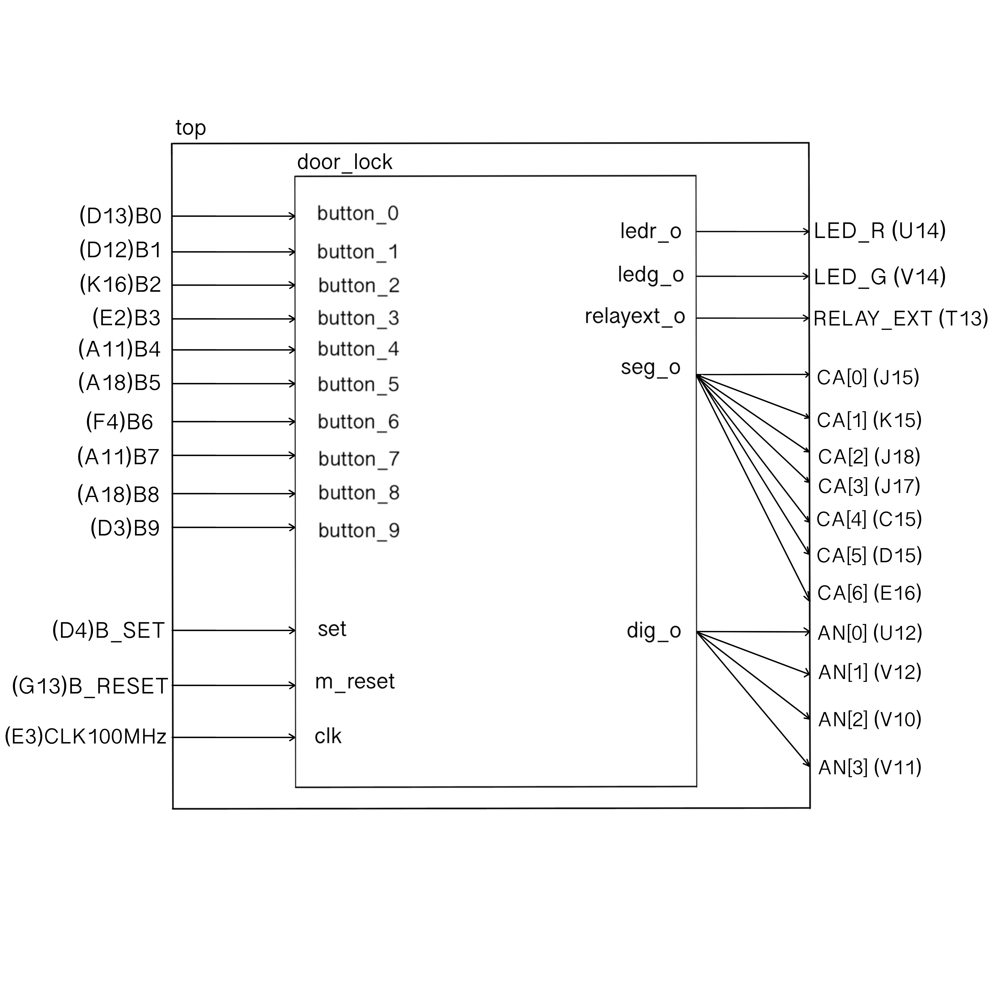

#### Description:

Provides interface between the project's (door_lock's) code and the pins of the FPGA. The chosen pins can be seen in the diagram above or the VHDL code below.

#### Constraints: [Arty-A7-100T.xdc](Final_Project/Constraints/Arty-A7-100T.xdc)
#### Bitstream file: [top.bit](Project_Files/Bitstream/top.bit)

#### VHDL architecture:
```vhdl
architecture Behavioral of top is

begin
    door_lock : entity work.door_lock
        port map(
            clk         => CLK100MHZ,
            -------------------------
            button_0    => B0,
            button_1    => B1,
            button_2    => B2,
            button_3    => B3,
            button_4    => B4,
            button_5    => B5,
            button_6    => B6,
            button_7    => B7,
            button_8    => B8,
            button_9    => B9,
            set         => B_SET,
            m_reset     => B_RESET,
            -------------------------
            ledg_o      => LED_G,
            ledr_o      => LED_R,
            relayext_o  => RELAY_EXT,
            seg_o       => CA, 
            dig_o       => AN  
        );


end Behavioral;
```
### Project Files: [door_lock.zip](Project_Files/door_lock.zip)

## Video

[Video na YouTube](https://www.youtube.com/watch?v=wTUz-jFWRrE)


## References

   1. https://github.com/tomas-fryza/Digital-electronics-1
   2. https://www.youtube.com/channel/UCbUe5SLMSZlSzCuJP81lU0A and https://www.youtube.com/c/iit/videos
   3. https://forums.xilinx.com/